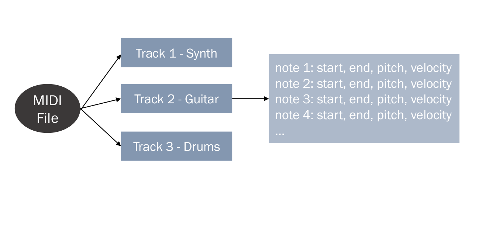
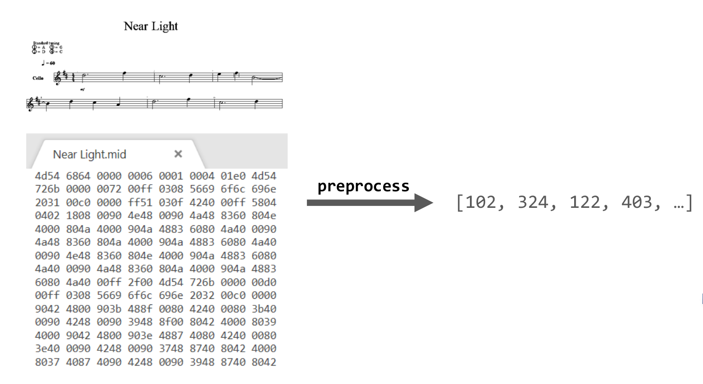
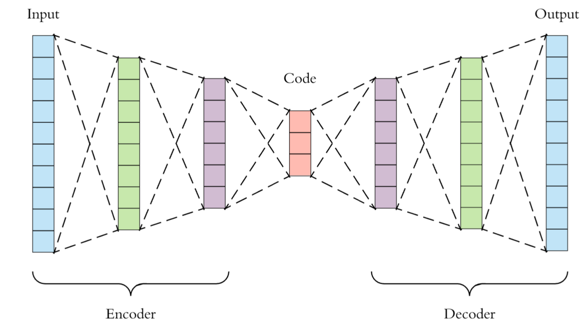
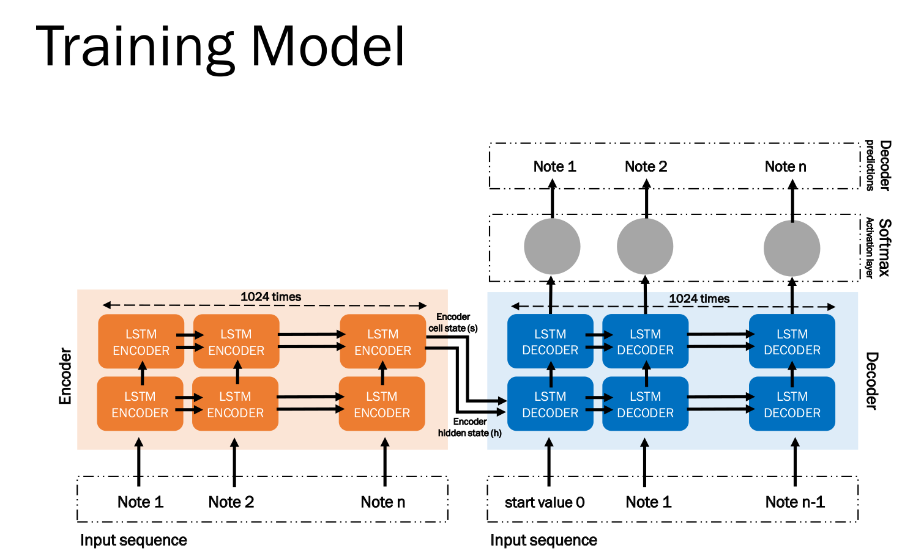
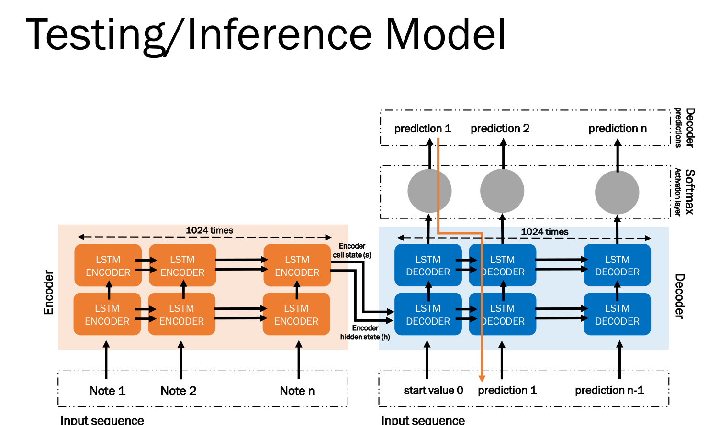

# music composer with Tensorflow
* for more information about the project visit :
*https://github.com/fatemetkl/music-generator-Tensorflow-/blob/master/Music%20Composer-presentation.pdf*                                                                                
* the music composer implementation using keras is available at *https://github.com/fatemetkl/Music-composer-keras*

“What I cannot create,
I cannot understand.”- Richard Feynman

## DATA
• Project’s dataset is a collection of about 175,000
MIDI files (we used The Lakh MIDI Dataset v0.1)
• We used pretty_midi to help us with reading and
writing.
MIDI file structure looks like this:

                            
• As mentioned in the chart , we
see that each song has multiple instruments
• But we chose the instrument with longest bars
(so in each song, the instrument with greatest
number of notes were kept)
• Drum based instruments were left out because
they have different annotation system than other
instruments like piano, violin, etc.

• Each note has this values:

Start time
End time
Pitch
Velocity
• We categorized each note due to its values.
• Then we hot-encoded notes due to categories

### Data - hot-encode
• Instead of start time and end time we used the
difference between them (duration) and we
already had velocities and pitches.
• We calculated max value for each of the three
variables mentioned above and splitted the notes
according to their distribution of all notes in that
song.

### Batches
• Instead of loading all the training dataset at once,
training data are loaded in sets of specific size
(definition of batch)
• We have a BatchProcessor class that
generates batches for each iteration.
• Each batch’s notes are one-hot-encoded together.

## MODEL
• We needed an architecture that generates new
songs.
• First of all, because we needed to generate new
songs, we used encoder-decoder architecture.
• Second of all, because music and songs are
sequential, we needed to use recurrent networks;
so we chose LSTM.

### Model – encoder decoder

### Good things about LSTM
• It can be difficult to train standard RNNs to solve
problems that require learning long-term
temporal dependencies because of gradient
vanishing
• LSTM has memory; it can maintain information in
its memory for long periods of time.
• A set of gates is used to control when information
enters the memory, when it's output, and when
it's forgotten.

## Network implementation - TF
• We used TensorFlow.
• We needed to have control over our network and
TensorFlow gave us more control than Keras
• For example, in TF, we have a computation graph
that we can do any computation with any input
that we want.
• Also TF is more used in researches and building
new networks as well.
• TF’s syntax is harder than Keras and might be
more confusing.

